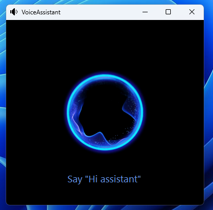

# Voice-Assistant

Voice-Assistant is a C# program that utilizes Microsoft's Speech Platform to provide voice recognition and text-to-speech capabilities. This software is designed to enable a seamless way of communicating with a computer using voice commands, allowing users to interact with their computer naturally. Voice-Assistant is highly customizable and supports multiple languages through user-packaged language models (UPLMs), making it a versatile solution for users with different needs.

<section align='center'>

</section>

## Technologies

- C# programming language
- Microsoft's Speech Platform
- .NET Framework

## Features

- Executes any task that can be run through the terminal, including opening applications, playing music, executing system commands, and more.
- Provides text-to-speech capabilities for user feedback, enabling users to receive audible confirmation when a task has been completed successfully.
- Supports multiple languages through user-packaged language models (UPLMs), making it accessible to users worldwide.
- Supports voice recognition for different users, enabling multiple users to interact with their computer using their voice.
- Highly customizable and extendable, allowing users to define new commands and actions.

## Prerequisites

Before using Voice-Assistant, make sure you have the following:

- Microsoft Speech Platform Runtime (x86) and Microsoft Speech Platform SDK (x86) installed on your computer. You can download these components from the Microsoft website.
- A microphone available and properly configured to use the voice recognition features.
- An internet connection to download the necessary UPLMs for your desired language.
- A complete language package for your desired language installed on your computer. Note that not all languages have complete language packages available. If a complete language package is not available, Voice-Assistant may not be able to recognize certain words or phrases in that language.

## How it works

Voice-Assistant uses text-to-speech to receive voice inputs and execute commands. The software reads the voice entry and compares it to the commands written on a `TextFiles/DefaultCommands.txt` file. If the voice entry matches an action case, the software responds with the programmed response.

## Usage

To use the software, follow these steps:

1. Clone the repository to your local machine.
2. Open the `VoiceAssistant.sln` file in Visual Studio.
3. Build the solution to compile the executable.
4. Run the compiled executable on your computer.
